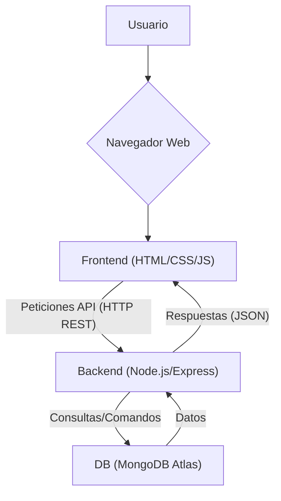
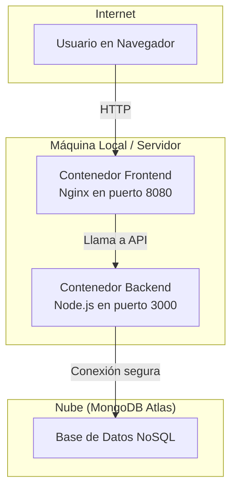

# 🚀 Flujo Genérico de Aprobación - Kata Junior

_Este documento está escrito en formato Markdown, compatible con la sintaxis MDX y optimizado para su visualización en GitHub._

## 1. Contexto del Proyecto

En muchos entornos corporativos, existen múltiples procesos que requieren la aprobación de un responsable antes de poder ser ejecutados. Estos flujos suelen ser manuales, informales (vía email o chat) o se gestionan a través de diversas herramientas no centralizadas.

Este proyecto nace como solución a esa problemática, desarrollando una **aplicación web centralizada** que gestiona un flujo genérico de aprobación. La aplicación permite a los usuarios crear solicitudes, notificar a los responsables, gestionar las aprobaciones o rechazos, y mantener un historial completo y trazable de todas las decisiones. El objetivo es formalizar y centralizar estos procesos, mejorando la eficiencia y la auditoría.

## 2. Características Principales

*   **Creación de Solicitudes:** Formulario dinámico para generar nuevas solicitudes de aprobación.
*   **Bandeja de Entrada e Historial:** Una vista unificada donde los usuarios pueden ver tanto las solicitudes que deben aprobar como el historial completo de las solicitudes que han creado.
*   **Notificación Simulada:** Una insignia en la pestaña de la bandeja de entrada notifica a los responsables sobre las solicitudes pendientes.
*   **Validaciones de Negocio:**
    *   Verificación de que el NIT del cliente esté en una lista de autorizados en la base de datos.
    *   Límite de un máximo de 2 solicitudes pendientes por usuario para evitar la saturación.
*   **Despliegue Contenerizado:** La aplicación está completamente "dockerizada" para asegurar la portabilidad y consistencia del entorno.

## 3. Arquitectura de la Solución

La aplicación sigue una arquitectura cliente-servidor desacoplada, desplegada en contenedores Docker para mayor portabilidad.

### Diagrama Lógico



### Diagrama de Despliegue (Docker)



*   El **Usuario** interactúa con el **Frontend** a través de su navegador en el puerto 8080.
*   El **Frontend** (servido por Nginx) no contiene lógica de negocio. Su única tarea es mostrar la interfaz y realizar llamadas a la API del backend.
*   El **Backend** (corriendo en el puerto 3000) expone la API REST, procesa todas las reglas de negocio y se comunica de forma segura con la base de datos.
*   La **Base de Datos** está alojada en MongoDB Atlas, desacoplando el almacenamiento de datos de la infraestructura de la aplicación.

## 4. Tecnologías Utilizadas

*   **Frontend:**
    *   **Lenguajes:** HTML5, CSS3, JavaScript (ES6+)
    *   **Comunicación:** `Fetch API` para la comunicación asíncrona con el backend.

*   **Backend:**
    *   **Entorno:** Node.js
    *   **Framework:** Express.js para la API REST.
    *   **Drivers:** `mongodb` para la conexión a la base de datos y `dotenv` para la gestión segura de variables de entorno.

*   **Base de Datos:**
    *   **Tipo:** NoSQL (No Relacional).
    *   **Motor:** MongoDB.
    *   **Alojamiento:** MongoDB Atlas (DBaaS en la nube).

*   **Despliegue y Orquestación:**
    *   **Contenedores:** Docker & Nginx.

## 5. Guía de Despliegue Local con Docker

Para ejecutar este proyecto en un entorno local, por favor siga estos pasos.

### Prerrequisitos
*   Git instalado.
*   [Docker Desktop](https://www.docker.com/products/docker-desktop/) instalado y en ejecución.

### Pasos

1.  **Clonar el repositorio:**
    ```bash
    git clone https://github.com/ginirocha45/flujo_generico_aprbacion.git
    cd flujo_generico_aprobacion
    ```

2.  **Configurar las Variables de Entorno del Backend:**
    *   Navegue a la carpeta `backend`.
    *   Cree un archivo llamado `.env`.
    *   Copie y pegue el siguiente contenido en el archivo `.env`, **reemplazando la cadena de conexión** con la suya de MongoDB Atlas:
    ```
    DB_CONNECTION_STRING=mongodb+srv://tu_usuario:tu_password@tu_cluster.mongodb.net/
    DB_NAME=kataBancoDB
    ```

3.  **Inicializar la Base de Datos (Opcional):**
    *   Para poblar la base de datos con datos de prueba, navegue a la carpeta `backend` y ejecute el script de inicialización:
    ```bash
    cd backend
    node init-db.js
    cd .. 
    ```

4.  **Construir las imágenes de Docker:**
    *   Desde la carpeta **raíz** del proyecto (`flujo_generico_aprobacion`), ejecute los siguientes comandos:
    ```bash
    # Construir la imagen del backend
    docker build -t kata-backend ./backend

    # Construir la imagen del frontend
    docker build -t kata-frontend ./frontend
    ```

5.  **Crear una red de Docker y Ejecutar los contenedores:**
    ```bash
    # Crear una red privada para los contenedores
    docker network create kata-net

    # Ejecutar el contenedor del backend en el puerto 3000 (es importante que este inicie primero)
    docker run -d --name backend-container --network kata-net --env-file ./backend/.env -p 3000:3000 kata-backend

    # Ejecutar el contenedor del frontend en el puerto 8080
    docker run -d --name frontend-container --network kata-net -p 8080:80 kata-frontend
    ```

6.  **Acceder a la aplicación:**
    *   ¡Listo! Abra su navegador web y vaya a la siguiente dirección:
    *   **[http://localhost:8080](http://localhost:8080)**

## 6. Guía de Revisión y Pruebas

Para revisar y probar la funcionalidad completa de la aplicación, por favor siga los siguientes escenarios.

### ✅ Prueba del "Camino Feliz" (Flujo completo)

1.  **Crear una solicitud:**
    *   En la pestaña **"Crear Nueva Solicitud"**, ingrese los datos. Por ejemplo:
        *   **NIT Cliente:** `900123456-7` (debe ser uno de los válidos).
        *   **Solicitante:** `usuario.general`
        *   **Responsable de Aprobar:** `jefe.area`
    *   Haga clic en **"Enviar Solicitud"**. Debería ver una alerta de éxito.

2.  **Revisar como Aprobador:**
    *   Vaya a la pestaña **"Bandeja de Entrada"**.
    *   En el campo de filtro, escriba `jefe.area`.
    *   **Verificación:** Debería aparecer una insignia de notificación. La solicitud creada aparecerá en la lista con estado "pendiente" y con los botones de acción.

3.  **Aprobar la solicitud:**
    *   Añada un comentario y haga clic en **"Aprobar"**.
    *   **Verificación:** La tarjeta se actualizará, el estado cambiará a "aprobado" y los botones de acción desaparecerán.

4.  **Verificar el Historial:**
    *   En el campo de filtro, escriba `usuario.general` (el solicitante original).
    *   **Verificación:** La misma solicitud aparecerá ahora con el estado "aprobado" y el historial del comentario dejado por `jefe.area`.

### ❌ Pruebas de Validaciones y Reglas de Negocio

1.  **NIT no autorizado:**
    *   Intente crear una solicitud con un NIT que no esté en la base de datos (ej: `111111111-1`).
    *   **Resultado esperado:** El formulario no se enviará y aparecerá un mensaje de error en rojo debajo del campo NIT.

2.  **Límite de Solicitudes Pendientes:**
    *   Como `usuario.general`, cree dos solicitudes pendientes.
    *   Intente crear una **tercera** solicitud pendiente.
    *   **Resultado esperado:** Aparecerá una alerta indicando que se ha alcanzado el límite de 2 solicitudes pendientes.